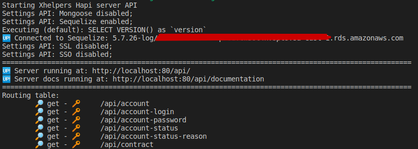

# XHelpers - API - 1.0.11

[](https://www.npmjs.com/package/xhelpers-api)

[](http://forthebadge.com) [](http://forthebadge.com)[](http://forthebadge.com)

[](http://makeapullrequest.com)[](https://github.com/sindresorhus/awesome)

## Description

This project was made for personal use, it should simplify the process of creating an new api using node js + typescript + singledb(mongo or mysql).

Stacks:

- [TypeScript](https://www.typescriptlang.org/).
- [Node.js](https://nodejs.org/).
- [Mongodb](https://www.mongodb.com/).
  - [Mongoose](https://mongoosejs.com/).
- [Sequelize](https://sequelize.org/).
  - [MySQL](https://www.mysql.com/).
  - [PostgreSQL](https://www.postgresql.org/).
- [Hapi](https://hapi.dev/).
- [Boom](https://github.com/hapijs/boom).
- [JWT](https://github.com/dwyl/hapi-auth-jwt2).
- [SSO bell](https://github.com/hapijs/bell).
- [Hapi-swagger](https://github.com/glennjones/hapi-swagger).

## Roadmap

- 🔥 Update packages to @hapi/pkg
- 🔥 Add tests and test each base service !!
- ➕ Simplify route and server usage.
- ➕ Update sequelize base service
- ➕ Create grapql base service
- Improve documentation
- Add samples

## Installation

```bash
$ npm i xhelpers-api
```

## Examples of usage

Server starter log:


### Hapi Server

Basics "createServer" method:

```code
Signature:
createServer({ serverOptions, options }:
{
  serverOptions: {
    port: number;
    host: string;
  };
  options: {
    swaggerOptions?: any;
    routeOptions: {
      dir: string;
      prefix?: string;
    };
    jwt_secret?: string;
    mongooseOptions?: any;
    sequelizeOptions?: any;
    enableSSL: boolean;
    enableSSO: boolean;
    ssoCallback: Function;
  };
}): Hapi.Server

const defaultServerOptions = {
    port: Number(process.env.PORT || 80),
    host: process.env.HOST || "localhost",
};

const defaultOptions = {
    swaggerOptions: {
      jsonPath: "/api/documentation/swagger.json",
      documentationPath: "/api/documentation",
      swaggerUIPath: "/api/swaggerui/",
      info: {
        title: "API",
        version: "1.0"
      },
      grouping: "tags",
      tags: []
    },
    jwt_secret: "v3ryH4rdS3cr3t",
    routeOptions: {
      dir: `${__dirname}/routes/**`,
      prefix: "/api"
    },
    enableSSL: process.env.SSL === "true",
    enableSSO: false,
    ssoCallback: (
      user: { email: any; name: any; avatar: any; token: string },
      userData: { userType: any; meta: any }
    ) => {},
  };
```

Usage:

```code
import createServer from "xhelpers-api/lib/server";

let server: any = {};
async function start() {
  const serverOptions: any = {};
  const options: any = {
    jwt_secret: "v3ryH4Rds3cr3t",
    swaggerOptions: {
      jsonPath: "/api/documentation/swagger.json",
      documentationPath: "/api/documentation",
      swaggerUIPath: "/api/swaggerui/",
      info: {
        title: "API",
        version: "1.1"
      }
    },
    routeOptions: {
      dir: `${__dirname}/routes/**`,
      prefix: "/api"
    },
    sequelizeOptions: {
      host: process.env.MYSQLDB_HOST,
      database: process.env.MYSQLDB_DATABASE,
      username: process.env.MYSQLDB_USER,
      password: process.env.MYSQLDB_PASSWORD,
      storage: process.env.MYSQLDB_STORAGE,
      models: [__dirname + "/model/**"]
    }
  };
  server = await createServer({ serverOptions, options });
  server.start();
}
start();
```

### Routes

```code
import Service from "/services/account-login";
import BaseRoute from "xhelpers-api/lib/base-route";

const httpResourcePath = "account-login";

class RouteAccountLogin extends BaseRoute<Service> {
  constructor() {
    super(new Service(), [httpResourcePath]);

    this.route("POST", `/api/${httpResourcePath}`)
      .validate({ payload: createPayload })
      .handler(async (r, h, u) => {
        const entity = await this.service.create(u, r.payload);
        return h.response(entity).code(200);
      })
      .build();

    this.route("GET", `/api/${httpResourcePath}`)
      .validate({ query: this.defaultSearchQuery })
      .handler(async (r, h, u) => {
        return await this.service
          .queryAll(
            u,
            {
              filter: r.query.filter,
              fields: r.query.fields
            },
            {
              page: r.query.page,
              limit: r.query.limit,
              sort: r.query.sort
            }
          )
          .then(entities => h.response(entities).code(200));
      })
      .build();

    this.route("GET", `/api/${httpResourcePath}/{id}`)
      .validate({ params: this.defaultIdProperty })
      .handler(async (r, h, u) => {
        return await this.service
          .getById(u, r.params.id)
          .then(entity =>
            entity ? h.response(entity).code(200) : Boom.notFound()
          );
      })
      .build();

    this.route("PUT", `/api/${httpResourcePath}/{id}`)
      .validate({ params: this.defaultIdProperty, payload: createPayload })
      .handler(async (r, h, u) => {
        return await this.service
          .update(u, r.params.id, r.payload)
          .then(() => h.response({}).code(200));
      })
      .build();

    this.route("DELETE", `/api/${httpResourcePath}/{id}`)
      .validate({ params: this.defaultIdProperty })
      .handler(async (r, h, u) => {
        return await this.service
          .delete(u, r.params.id)
          .then(() => h.response({}).code(200));
      })
      .build();
  }
}
exports.routes = server => server.route(new RouteAccountLogin().buildRoutes());
```

### Service

```code
//contract
export interface IBaseService {
  queryAll(
    user: any,
    filter: any,
    pagination: {
      page: number;
      limit: number;
      sort: any;
    },
    populateOptions?: {
      path: string | any;
      select?: string | any;
    }
  ): Promise<any[]>;
  getById(
    user: any,
    id: any,
    projection: any,
    populateOptions?: {
      path: string | any;
      select?: string | any;
    }
  ): Promise<any>;
  create(user: any, payload: any): Promise<any>;
  update(user: any, id: any, payload: any): Promise<any>;
  delete(user: any, id: any): Promise<void>;
}
```

```code
import AccountLogin from "/model/account_login"; // mongoose or sequelize "Model"
import BaseServiceSequelize from "xhelpers-api/lib/base-service-sequelize";
import BaseServiceMongoose from "xhelpers-api/lib/base-service-mongoose";

// mongoose
export class AccountLoginService extends BaseServiceMongoose<
  AccountLogin
> {
  constructor() {
    super(AccountLogin);
  }
  sentitiveInfo: any = ["-__v", "password"];
  protected async validate(entity: AccountLogin, payload: AccountLogin): Promise<boolean> {
    const invalid = false;
    if (invalid) throw new Error("Invalid payload.");
    return Promise.resolve(true);
  }
}

// sequelize
export class AccountLoginSqlService extends BaseServiceSequelize<
  AccountLogin
> {
  constructor() {
    super(AccountLogin);
  }
  sentitiveInfo: any = ["id"];
  protected async validate(
    entity: AccountLogin,
    payload: AccountLogin
  ): Promise<boolean> {
    const invalid = false;
    if (invalid) throw new Error("Invalid payload.");
    return Promise.resolve(true);
  }
}
```

### Models - Mongoose / Sequelize

### Mongoose: account_login

```code
import * as mongoose from 'mongoose';

export interface AccountLogin extends mongoose.Document {
  ip_number: string;
  browser: string;
  created_at: Date;
}

const schema = new mongoose.Schema({
  ip_number: { type: String , required: true},
  browser: { type: String },
  created_at: { type: Date, required: true },
});

schema.set('toJSON', { virtuals: true });

export default mongoose.model<AccountLogin>('AccountLogin', schema, 'account_login');
```

### Sequelize: account_login

```code
import {
  BelongsTo,
  Column,
  CreatedAt,
  ForeignKey,
  Model,
  Scopes,
  Table
} from "sequelize-typescript";

@Scopes(() => ({}))
@Table({ tableName: "account_login", updatedAt: false })
export default class AccountLogin extends Model<AccountLogin> {
  @Column
  ip_number: string;
  @Column
  browser: string;
  /* auto */
  @CreatedAt
  @Column
  created_at: Date;
}
```

## Building

```bash
# build tsc
$ npm run build
```

## Test

[Pending]

## Support

[Pending]

## Stay in touch

- Author - [wmkdev](https://github.com/wmkDev)

## License
